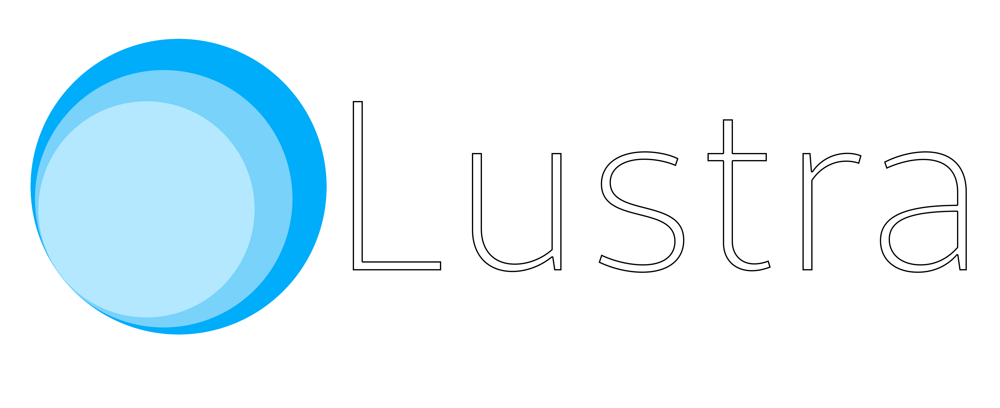

<p align=center>
    
</p>

#


## What is Lustra?
**Lustra** is a small WIP game engine written in C++. As a successor to my previous project **3Dev**, **Lustra** aims to provide the most flexible, simple and intuitive experience, as well as being **lightweight** and **powerful**.

## Features
- **Free** and **open source** - **forever**
- **LLGL** as a graphics backend
- Extensible **PBR** renderer pipeline with **HDR** and customizable post processing effects
- **Entity Component System** - yet with some assumptions ;)
- **Jolt Physics** support
- Scripting with **Angelscript**
- And much more...

## Building
Every direct dependency is included within this repository as a submodule:
```bash
git clone --recursive --depth=1 https://github.com/1Kuso4ek1/Lustra.git
```
And as with any other CMake project, create `build` directory, configure and build
```bash
cd Lustra
mkdir build && cd build
cmake .. -DCMAKE_BUILD_TYPE=Release
make -j$(nproc)
```

## Warning!
This project and even this readme is still in the very early stage of development, so don't expect any high quality product (yet)